[View Korean README (한국어 README 보기)](README.ko.md)

# Multi-Post AI Agent (Education Project)

## 🌟 Project Introduction

This is an educational project aimed at developing an AI-based multilingual blog posting automation agent.
It is conducted in a "Vibecoding" style with the Caret AI assistant, providing hands-on experience in AI agent development and LangGraph utilization.

## 🎯 Project Objectives

* Provide coding practice experience using the Caret AI assistant
* Learn the AI agent development process
* Practice building AI workflows using LangGraph
* Provide educational scenarios and related resources

## 🚀 Phase 1 Development Goals (For Educational Practice)

* **Platform:** A simple web application running locally (Python FastAPI + HTML/JS)
* **Core Features:**
    1. Transform user input into a specific style/format (e.g., change tone, translate) via LangGraph
    2. Automatically post the transformed result to a single blog platform
* **Learning Objectives:** Understand the basic flow of an AI agent and practice FastAPI & LangGraph fundamentals

## 🔧 Tech Stack (For Phase 1)

* **Backend & AI Workflow:** Python, FastAPI, LangGraph
* **Frontend:** HTML, CSS, JavaScript (simple UI)
* **Development Assistant:** Caret

## 📝 Educational Scenario

Please refer to the [docs/education-scenario.md](docs/education-scenario.md) document for a detailed educational scenario.

**Note on Educational Materials:** Currently, the primary educational materials linked within `docs/education-scenario.md` (such as the presentation slides) are provided in Korean only. An English version is planned for the future, and contributions to translate these materials are welcome.

## 📂 Project Design and Key Document Guide

This project has prepared key documents in the following order and for the following purposes to facilitate systematic development with the AI assistant (Caret - Alpha). This process is designed to help the AI clearly understand the project requirements, perform development tasks according to the plan, and enable trainees to effectively practice collaboration with AI. Each document is progressively detailed based on the previous stage's document, playing a crucial role in successful project execution and achieving educational goals.

1. **Define Educational Scenario (`docs/education-scenario.md`):**
    * **SW Engineering Phase:** Project Initiation & Goal Setting
    * **Reason & Dependency:** The starting point for all projects and education. Without this document, the project's direction and goals become unclear. It provides a clear definition of 'what to do and why,' serving as a standard for all subsequent documents and development activities.
    * **Key Contents:** Includes educational objectives, overall process, schedule, and materials. The initial idea was fleshed out to expand educational goals and scope to include Blogger API integration, and related setup steps were added.

2. **Prepare External API Integration Guide (`docs/google-api-references.md`):**
    * **SW Engineering Phase:** Technical Feasibility & Environment Scan
    * **Reason & Dependency:** As Blogger integration was set as a goal in `education-scenario.md`, this document identifies and organizes the usage and authentication methods (OAuth 2.0) for the necessary external API (Google Blogger API). Its purpose is to review technical feasibility and reduce trial and error in subsequent requirements and development processes.
    * **Key Contents:**
        * [Google API General Reference](./docs/google-api-references.md): Includes specific instructions for enabling the Blogger API and setting up OAuth 2.0 Client ID.
        * [Google Blogger API Detailed Guide](./docs/google-blogger-api-guide.md): Contains detailed information on using each endpoint of the Blogger API.

3. **Detail Requirements Specification (`docs/requirement.md`):**
    * **SW Engineering Phase:** Requirements Analysis & Specification
    * **Reason & Dependency:** Based on the educational objectives from `education-scenario.md` and the technical review from `google-api-references.md`, this document specifically defines "what to build." It is the core foundation for the AI to understand the features to be developed, user experience (scenarios), and the overall system structure.
    * **Key Contents:** Added simplified web application requirements, user scenarios including an "auto-publish" option, and system architecture (Mermaid diagram).

4. **Define Page Design (`docs/page-design.md`):**
    * **SW Engineering Phase:** UI/UX Design
    * **Reason & Dependency:** Visually concretizes how users will interact with the features and user scenarios defined in `requirement.md` through the screen. It guides the AI to provide a consistent user experience and create all necessary UI elements when implementing the frontend.
    * **Key Contents:** Specifies web UI layout, key components, simple style guide, and logo image usage.

5. **Establish AI Development Guidelines (`docs/development-guide.md`):**
    * **SW Engineering Phase:** Architectural & Detailed Design
    * **Reason & Dependency:** Based on "what" and "how it will look" defined in `requirement.md` and `docs/page-design.md`, this provides a blueprint for "how the AI will technically implement it." It specifies the project's tech stack, directory structure, main module design, and core logic implementation direction to help the AI write code systematically and consistently.
    * **Key Contents:** Includes project directory structure, FastAPI backend design, and LangGraph workflow design.

6. **Establish Documentation Standards (`docs/documentation-guide.md`):**
    * **SW Engineering Phase:** Development Standards & Environment Setup - Documentation part
    * **Reason & Dependency:** As various documents (from `education-scenario.md` to `development-guide.md`) were created as the project progressed, standards are needed to maintain consistency in writing and managing all project documents, including these. This contributes to both AI and users efficiently utilizing documents and clearly sharing project information.
    * **Key Contents:** Specifies the role and update cycle of each document, file naming conventions (kebab-case), and task document writing methods.

7. **Define Project Rules (`.caretrules`):**
    * **SW Engineering Phase:** Development Standards & Environment Setup - AI collaboration rules part
    * **Reason & Dependency:** A custom rule set to help the AI assistant better understand the project's characteristics (derived from `requirement.md`, `development-guide.md`, etc.) and development process (defined in `documentation-guide.md`), and perform tasks aligned with the user's intent.
    * **Key Contents:** Defines project overview, architecture, and development process (documentation-first, task-based development, etc.).

8. **Establish Detailed Execution Plan (Task Documents `docs/tasks/`):**
    * **SW Engineering Phase:** Work Breakdown & Planning
    * **Reason & Dependency:** Consolidates all previously defined documents to break down actual development work into specific, executable small tasks. This allows the AI to perform tasks stepwise, clearly track progress, and effectively manage complex projects to achieve goals at each stage.
    * **Key Contents:**
        * `docs/tasks/task-list.md`: A summary document providing a list of all tasks and links to each detailed task document.
        * `docs/tasks/001-*.md` ~ `009-*.md`: Individual task documents including goals, detailed checklists, related documents, etc., for each task. The assignee is specified as "ai-assistant (Caret)".
    * **Specifics:** Task scope was reduced to be completable within 1.5 hours, and LangGraph settings were simplified.

```mermaid
flowchart TD 

    subgraph "Documentation Process Evolving with AI"

    subgraph "PRD-centric Development Approach" [PRD-centric Development Approach]
        A1["• Initial use based on PRD"]
        A2["• Unidirectional instruction"]
        A3["• No document updates"]
        A4["• Speed priority"]
    end

        USE["User Scenarios"]
        REQ["Requirements Specification - Functional & Non-functional"]
        ARCH["System Architecture / Development Guide / Design Specification"]
        TASK["Task List - Work Map"]
        GUIDE["Documentation Guide & AI Guidelines"]
        MARKDOWN["Markdown Documents (.md)"]
        JSON_RULES["JSON Conversion → .rules File"]
        AI_SYNC["AI Input & Intermediate Synchronization, Iterative Use"]
        
        subgraph "Core Philosophy" [Core Philosophy]
            P1["• Documents are contracts with AI, not just records"]
            P2["• .rules are sustainable context, not just commands"]
        end
    end

     

    USE --> REQ --> ARCH --> TASK --> GUIDE --> JSON_RULES --> AI_SYNC
    MARKDOWN --> JSON_RULES
    TASK -- "Update 🔁" --> TASK
    GUIDE --> JSON_RULES
    Core_Philosophy --> AI_SYNC

```

### ✨ Document Improvement Process and Importance of Continuous Updates

The key deliverables provided in this project, such as the requirements specification, development guide, page design, and individual task documents, were not perfectly drafted in one go. These documents are the result of continuous improvement and updates through close collaboration with the AI assistant (Caret), multiple development cycles, testing and debugging during actual implementation, and various trial-and-error processes encountered along the way.

Particularly, the first development cycle faced various technical issues and communication difficulties in areas like environment setup, API integration, LangGraph workflow design, and UI feedback processing. Based on these experiences, each document has been reinforced to minimize potential problems for trainees starting the project from scratch and to provide clearer guidelines. Detailed retrospectives and document-specific improvement suggestions can be found in the [Project Retrospective and Document Improvement Report](./docs/project-retrospective-and-improvement-report.md).

In software development, especially for projects dealing with complex and rapidly changing technologies like AI agents, it is crucial to recognize that initial designs or documents cannot be perfect. Actively communicating with AI during the actual development process, consistently logging issues and decisions made, and continuously updating and improving related documents based on this information are key to successful project execution and effective learning.

## 📄 License

This project is distributed under the following license terms.

### Source Code
- **English Original**: [`LICENSE`](LICENSE)
- **Korean Translation**: [`LICENSE.ko.md`](LICENSE.ko.md)
  * (Note: The Korean translation is for understanding purposes only, and the English original is legally binding.)

### Assets (Documents, Images, Media, etc.)
- **English Original**: [`ASSETS_LICENSE.md`](ASSETS_LICENSE.md)
- **Korean Translation**: [`ASSETS_LICENSE.ko.md`](ASSETS_LICENSE.ko.md)

Please retain author credit when reusing or modifying content.
