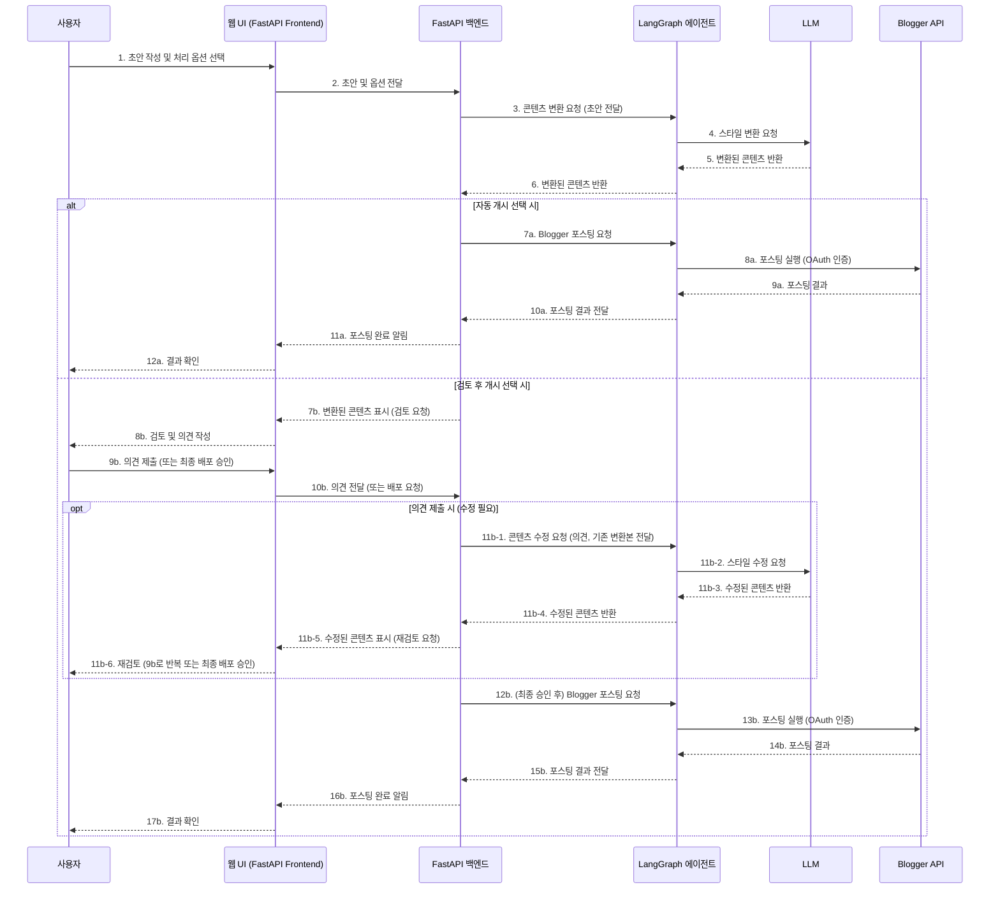
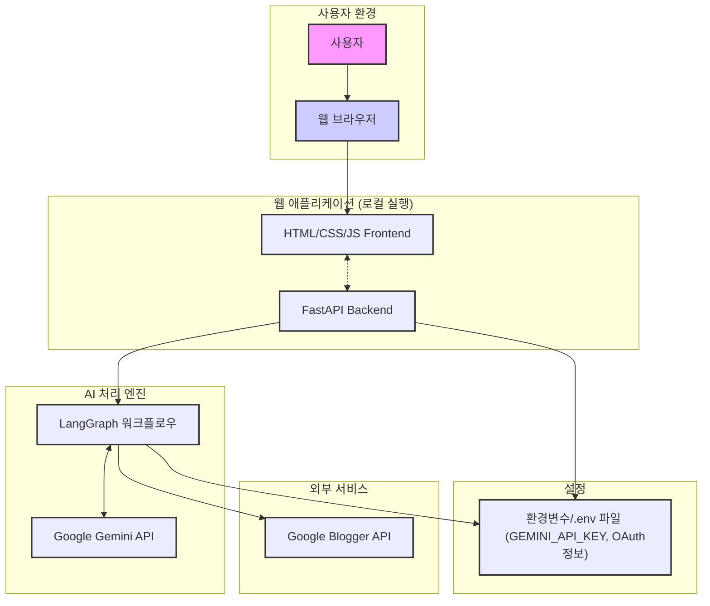

# 간소화된 프로젝트 요구사항: AI 콘텐츠 변환 및 Blogger 포스팅 에이전트 (교육용)

## 1. 프로젝트 개요

본 프로젝트는 사용자가 입력한 텍스트를 LangGraph를 통해 미리 정의된 스타일로 변환하고, 변환된 콘텐츠를 사용자의 선택(자동 또는 검토 후)에 따라 Blogger.com에 포스팅하는 로컬 웹 애플리케이션을 개발하는 것을 목표로 합니다. FastAPI를 백엔드로 사용하고, LangGraph를 통해 콘텐츠 변환 로직을 구현하며, Google Blogger API를 연동합니다.

## 2. 핵심 요구사항

### 2.1. 기술 스택 및 아키텍처 (웹 기반)

* **플랫폼:** 웹 애플리케이션 (FastAPI 백엔드, 간단한 HTML/CSS/JS 프론트엔드)
* **API 연동:** LLM API (Google Gemini), Blogger API (REST)
* **AI 워크플로우:** LangGraph (미리 정의된 콘텐츠 스타일 변환 및 포스팅 로직)
* **설정 관리:** `GEMINI_API_KEY`, Google OAuth 정보 (환경 변수 또는 `.env` 파일) (향후 개선 시: Blogger 인증 토큰 파일 저장 고려)

### 2.2. 주요 기능

* **웹 UI:**
    * 초안(제목, 내용) 작성 영역.
    * 처리 옵션("자동 개시" 또는 "검토 후 개시") 선택.
    * 변환/처리 결과 확인 영역.
    * (검토 시) 간단한 수정 의견 입력 영역.
    * (검토 시) 최종 배포 버튼.
    * 모든 API 요청(콘텐츠 처리, 검토 제출, 인증 등)에 대한 성공/실패 여부를 명확한 상태 메시지로 UI에 표시하고, 성공 시 필요한 결과(예: 포스팅 URL 링크)를 함께 제공.
* **콘텐츠 스타일 변환:**
    * LangGraph와 LLM을 이용한 **미리 정의된** 스타일 변환 (실습 시 LangGraph 내부 로직으로 다양한 변환 구현).
* **Blogger API 연동:**
    * OAuth 2.0을 통한 Blogger API 인증. 
    * 변환된 콘텐츠를 사용자의 Blogger 블로그에 새 글로 포스팅.

### 2.3. 사용자 시나리오 (웹 기반 - 더욱 간소화)

1. **초안 작성 및 처리 옵션 선택 (웹 UI):**
    * 사용자가 웹 UI에서 포스팅할 초안(제목, 내용)을 작성합니다.
    * 처리 옵션("자동 개시" 또는 "검토 후 개시")을 선택하고 "변환 및 처리 요청"을 시작합니다. (API: `/process_post`)
2. **AI 에이전트 처리 (LangGraph) - 1단계 (최초 변환 또는 자동 개시 처리):**
    * **자동 개시 선택 시:**
        * 시스템은 LangGraph를 통해 콘텐츠를 변환하고 즉시 Blogger에 포스팅합니다.
        * 포스팅 완료 후 사용자에게 성공 메시지와 함께 게시글 URL을 UI에 표시합니다.
    * **검토 후 개시 선택 시:**
        * 시스템은 LangGraph를 통해 콘텐츠를 1차 변환합니다.
        * 변환된 콘텐츠와 함께 사용자 검토를 위한 UI(수정 의견 입력란, 의견 제출 버튼, 최종 배포 버튼)를 표시하고, 시스템은 사용자의 다음 액션을 대기합니다. (LangGraph 실행은 이 단계에서 일단 종료되고 중간 결과를 반환)
3. **사용자 검토 및 피드백 처리 (LangGraph) - 2단계 ("검토 후 개시" 시에만 해당):**
    * 사용자가 웹 UI에서 다음 중 하나의 액션을 수행합니다:
        * **수정 의견 제출 시 (API: `/submit_review`에 `final_publish=false` 및 의견 전달):**
            * 시스템은 전달받은 사용자 의견과 현재 변환된 콘텐츠를 바탕으로 LangGraph를 통해 콘텐츠를 재수정합니다.
            * 수정된 콘텐츠를 다시 사용자 검토를 위해 UI에 표시하고 대기합니다.
        * **최종 배포 승인 시 (API: `/submit_review`에 `final_publish=true` 전달, 의견은 선택 사항):**
            * 시스템은 현재 (또는 최종 수정된) 콘텐츠를 LangGraph를 통해 Blogger에 포스팅합니다.
            * 포스팅 완료 후 사용자에게 성공 메시지와 함께 게시글 URL을 UI에 표시합니다.
4. **Blogger 포스팅:**
    * Blogger API를 통해 최종 콘텐츠를 블로그에 게시합니다.

## 3. 다이어그램

### 3.1. 사용자 시나리오 흐름도 (Mermaid)

### 3.2. 시스템 아키텍처 (Mermaid)

## 4. 확장 요구사항 (추후 고려)

* 사용자가 UI에서 직접 다양한 변환 스타일을 선택하는 기능.
* Flutter를 사용한 멀티플랫폼 앱 개발.
* 다중 LLM 연동 및 고급 번역/검수 기능.
* 상세한 로컬 파일 관리 시스템.
* 기타 고급 기능 (Firebase 연동, 세부 UI/UX 개선 등).
